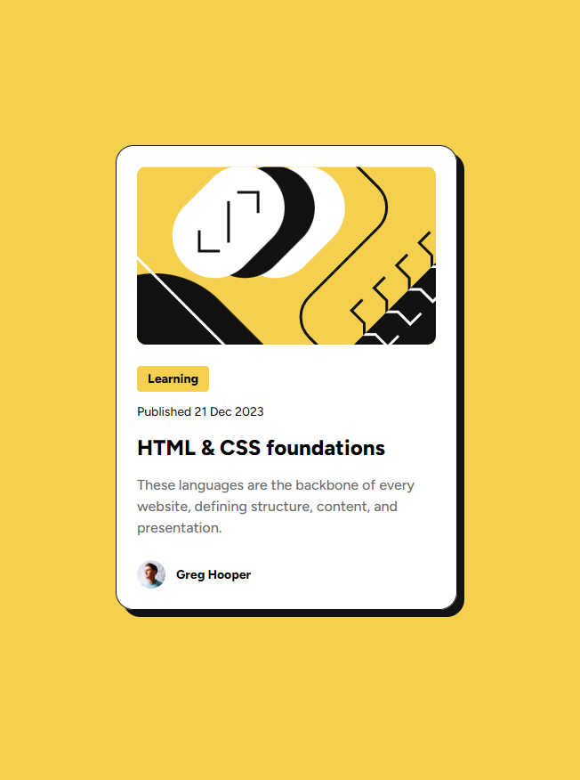

# Frontend Mentor - Blog preview card solution

This is a solution to
the [Blog preview card challenge on Frontend Mentor](https://www.frontendmentor.io/challenges/blog-preview-card-ckPaj01IcS).


## Table of contents

- [Overview](#overview)
    - [The challenge](#the-challenge)
    - [Screenshot](#screenshot)
    - [Links](#links)
- [My process](#my-process)
    - [Built with](#built-with)
    - [What I learned](#what-i-learned)
    - [Useful resources](#useful-resources)
- [Author](#author)

## Overview

### The challenge

Users should be able to:

- See hover and focus states for all interactive elements on the page

Etc:

- Add '<a>' to tags and author

### Screenshot



### Links

- Solution URL: [Add solution URL here](https://your-solution-url.com)
- Live Site URL: [Add live site URL here](https://your-live-site-url.com)

## My process

### Built with

- Semantic HTML5 markup
- CSS custom properties
- Flexbox
- Mobile-first workflow

### What I learned

- a How to expand the `<a>` tag range to the entire container (card)
  ```css
  .card a.link::after {
    position: absolute;
    inset: 0;
    z-index: 1 !important;
    content: "";
  }
  ```

- How to respond when there are interactive elements according to the expanded scope of `<a>` tag
  ```css
  .card {
    position: relative;
  }
  
  .card a:not(.link) {
    position: relative;
    z-index: 10;
  }
  ```

- Fixed issue where parent height increases when using `display: inline-flex;`
  ```css
  .card .author {
    display: inline-flex;
    vertical-align: middle;
  }
  ```

- Font size response without media query using `clamp(...)`
  ```css
  /* to children */
  .text-preset-3-bold {
    font-size: 0.875em;
  }
  
  /* to parent */
  .text-responsive {
    font-size: clamp(14px, 2.1875vw, 16px);
  }
  ```

- Figma's border inside is implemented as `box-shadow`
  ```css
  .card {
    box-shadow: 0 0 0 1px var(--gray-950) inset, 8px 8px 0 0 var(--gray-950);
  }
  ```

### Useful resources

- [Responsive Blog Preview Card with no media queries](https://www.frontendmentor.io/solutions/responsive-blog-preview-card-with-no-media-queries-hFFjkRd1XH) -
  Example : How to adjust font size without media query.

## Author

- Frontend Mentor - [@Untest57](https://www.frontendmentor.io/profile/Untest57)
