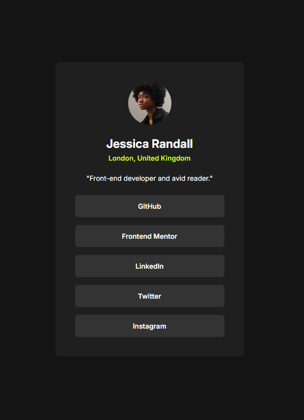

# Frontend Mentor - Social links profile solution

This is a solution to
the [Social links profile challenge on Frontend Mentor](https://www.frontendmentor.io/challenges/social-links-profile-UG32l9m6dQ).

## Table of contents

- [Overview](#overview)
    - [Screenshot](#screenshot)
    - [Links](#links)
- [My process](#my-process)
    - [Built with](#built-with)
    - [What I learned](#what-i-learned)
- [Author](#author)

## Overview

### Screenshot



### Links

- [Solution](https://www.frontendmentor.io/solutions/social-links-profile-44auFMedI_)
- [Live Site](https://frontendmentor-three-iota.vercel.app/03-social-links-profile/)

## My process

### Built with

- Semantic HTML5 markup
- CSS custom properties
- Flexbox
- Mobile-first workflow

### What I learned

- Add desired `weight` in Google Font API
  ```html
  <link href="https://fonts.googleapis.com/css2?family=Inter:opsz,wght@14..32,400;14..32,600;14..32,700&display=swap" rel="stylesheet">
  ```

## Author

- Frontend Mentor - [@Untest57](https://www.frontendmentor.io/profile/Untest57)

