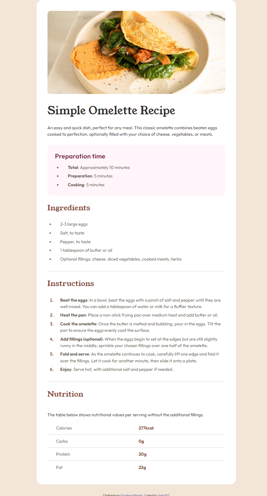

# Frontend Mentor - Recipe page solution

This is a solution to
the [Recipe page challenge on Frontend Mentor](https://www.frontendmentor.io/challenges/recipe-page-KiTsR8QQKm).

## Table of contents

- [Overview](#overview)
    - [Screenshot](#screenshot)
    - [Links](#links)
- [My process](#my-process)
    - [Built with](#built-with)
    - [What I learned](#what-i-learned)
    - [Useful resources](#useful-resources)
- [Author](#author)

## Overview

### Screenshot

### Links

- Solution URL: [Add solution URL here](https://your-solution-url.com)
- Live Site URL: [Add live site URL here](https://your-live-site-url.com)

## My process

### Built with

- Semantic HTML5 markup
- CSS custom properties
- Flexbox
- Mobile-first workflow
- SCSS

### What I learned

- List Marker Styling
- Using `cqw`

### Useful resources

- [List Marker Gap](https://css-tricks.com/everything-you-need-to-know-about-the-gap-after-the-list-marker/) - You can
  check what `padding, margin` looks like in the list mark.

## Author

- Frontend Mentor - [@Untest57](https://www.frontendmentor.io/profile/Untest57)
