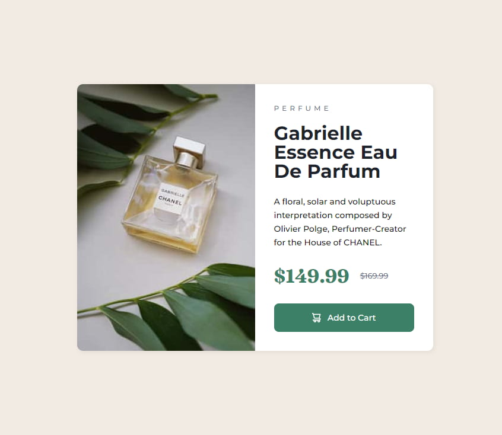

# Frontend Mentor - Product preview card component solution

This is a solution to the [Product preview card component challenge on Frontend Mentor](https://www.frontendmentor.io/challenges/product-preview-card-component-GO7UmttRfa). Frontend Mentor challenges help you improve your coding skills by building realistic projects. 

## Table of contents

- [Overview](#overview)
  - [The challenge](#the-challenge)
  - [Screenshot](#screenshot)
  - [Links](#links)
- [My process](#my-process)
  - [Built with](#built-with)
  - [What I learned](#what-i-learned)
  - [Continued development](#continued-development)
  - [Useful resources](#useful-resources)
- [Author](#author)
- [Acknowledgments](#acknowledgments)

## Overview

### The challenge

Users should be able to:

- View the optimal layout depending on their device's screen size
- See hover and focus states for interactive elements

### Screenshot




### Links

- [Solution](https://www.frontendmentor.io/solutions/product-preview-card-component-W2CYfMcotd)
- [Live Site](https://frontendmentor-three-iota.vercel.app/05-product-preview-card-component/)

## My process

### Built with

- Semantic HTML5 markup
- Scss
- Flexbox
- Mobile-first workflow

### What I learned

- Using `<picture>` changed Image
  ```html
  <picture class="card__picture">
    <source
      media="(min-width: 768px)"
      srcset="./images/image-product-desktop.jpg"
    />
    
  </picture>
  ```

## Author

- Frontend Mentor - [@Untest57](https://www.frontendmentor.io/profile/Untest57)